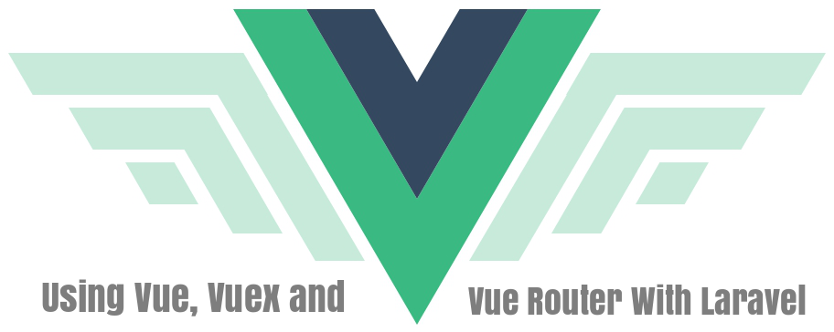

# VueX Laravel Admin
Admin Panel with Menu, File Manager and Statistic graph


Stack:
- [VueX](https://vuejs.org/)
- [Laravel](https://laravel.com/)
- [Admin LTE](https://adminlte.io/themes/AdminLTE/index2.html)

## Install
Just run some basic commands:
```bash
$ composer install
$ npm install
$ php artisan key:generate
```